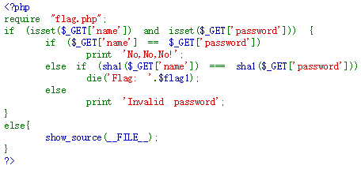
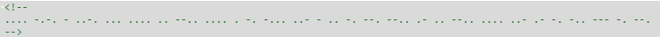

# MISC

### MISC 驾驶技术科目一

`如果玩转 MISC 快来开始你的科目一吧！ 链接: http://pan.baidu.com/s/1c1c7fiC 密码: cyyd`

给了一个pcapng（pcap的变种）文件，打开后发现有1w多数据包，用`http&&http contains "POST"`过滤，没发现上传什么有用的数据，更改为`http`，
大致翻了一下,发现有带aklis的网站，更改条件为`http&&http contains "aklis"`，过滤后逐个打开请求的URI，发现base64字符串（貌似哪个网站有
字符串是随机的），解密后又是一个base64字符串，然后又解密得到一张图片，然而那是科目二，后来在老司机的提醒下才发现第一次解密得到的base64
字符串就是科目一flag（惯性思维了，以为这次培训的flag都有特殊含义的）

### MISC 驾驶技术科目二

` 考完科目一的小伙伴快过来科目二啦，早上上路，争当中国好司机`

科目一得到的图片是个图种，后缀改为zip，解压出来

扫描二维码，得flag

### MISC从0开始之编码1	

`老司机的题目做不出来？丢一题简单的给你们做。。 http://ctf.lazysheep.cc:8081/misc1.html`
`Hint: base全家桶`

刚开始以为base全家桶指的是base16/32/64这些编码方式，然后猜测可能是base32或16，结果都不行
后来搜了下base全家桶，在一篇wp中才明白什么意思

然后仔细观察这些字符，不是base32就是hex，试了下hex

base32解密

。。。再base64解密

咦~终于出来了

了解各种编码方式是解这道题的关键

# WEB

### WEB从0开始之PHP代码审计0

  
==  只比较表达式的值是否相等
    
=== 比较表达式的值及类型是否相等
    
这里利用sha1函数特性，构造name[]=1&password[]=2，值不相等，跳过第一个判断，sha1处理数组时返回null，因此条件成立，得flag

# 密码学

### 密码学从0开始之1	 

摩斯密码

# PENTEST

### lightless&aklis的渗透教室-2

    http://120.27.53.238/pentest/02/http-header.php
    Hint: Mozilla/5.0 (iPhone; CPU iPhone OS 9_0 like Mac OS X) AppleWebKit/601.1.46 (KHTML, like Gecko) Version/9.0 Mobile/13A344 Safari/601.1
    xff: 127.0.0.1
    
  
  
curl命令      

    curl -H "User-Agent:Mozilla/5.0 (iPhone; CPU iPhone OS 99_0 like Mac OS X) AppleWebKit/601.1.46 (KHTML, like Gecko) Version/9.0 Mobile/13A344 Safari/601.1" -H "X-Forwarded-For:127.0.0.1" -H "Referer:http://www.google.com" http://120.27.53.238/pentest/02/http-header.php

发现这个

起初还以为自己输错命令了，后来去厕所时一想，“不在html中，那就是在html头中喽”，
回去修改了下命令，果然

